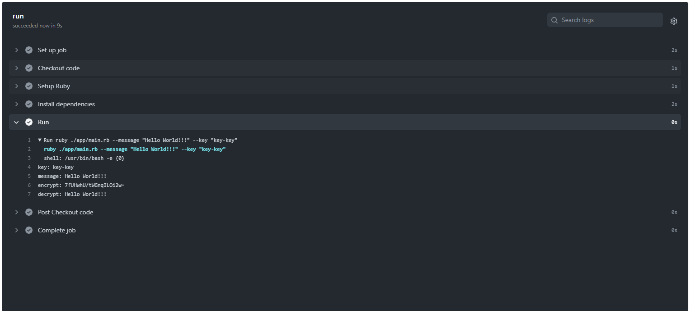

# simple-RC4.rb

🌿🌿🌿 RubyでRC4暗号を実装したものです。  

  

## 実行方法

```shell
gem install bundler
bundle install
ruby ./app/main.rb --message "メッセージ" --key "暗号化キー"
```

## 自分用メモ

転職先の企業でRubyを使うため、練習用として。  
Rubyに関するメモイロイロ。  

### gem bundle bundler

| name | description |
|:---|:---|
| gem | Rubyのパッケージ管理ツール |
| bundle | Gemfileに指定された依存関係を解決して、必要なgemを一括でインストールするためのツール |
| bundler | bundleコマンドを提供するgemパッケージ |

### コマンドイロイロ

```shell
# パッケージの初期化
gem install bundler
bundle init

# パッケージ一覧の復元
bundle install

# パッケージの追加
bundle add パッケージ名

# パッケージの削除
bundle remove パッケージ名

# パッケージの一覧
bundle list

# パッケージの更新
bundle update [パッケージ名]

# 非推奨のパッケージ一覧の表示
bundle outdated
```
